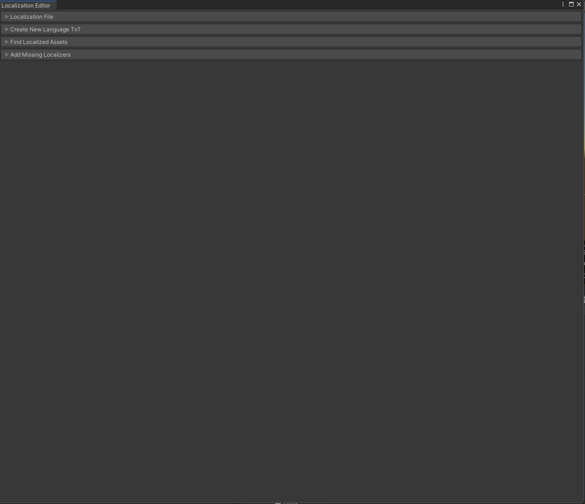

# 🌐 Language Change Tools for Unity

A handy Unity Editor tool for managing localization keys and language files directly within the Editor. Easily find, edit, and save localization keys, auto-attach components, and generate language files with zero hassle.


---

## 🚀 Features

- 🔍 Find all `TMP_Localizer` components in project prefabs
- ✏️ Edit `localizationKey` values directly in the Editor window
- 📅 Save changes back into `.txt` files and update prefab assets
- ➕ Automatically add `TMP_Localizer` to all `TMP_Text` components
- 🌍 Generate new language files based on any existing base language

---

## 🖼️ Screenshots

| Localization File View | Add Missing Localizers | Create Language View |
|------------------------|------------------------|----------------------|
|  |  |  |

More views:
- 
- 
- 

---

## 📆 Requirements

- Unity 2022.3+
- TextMeshPro
- [Odin Inspector](https://odininspector.com/) (Editor-only, for UI rendering)

---

## 🛠️ How To Use

1. Open the editor via `Tools > Localization Editor 🇨`
2. Select a language from the dropdown
3. Search or scroll to find any localization key
4. Use `Find All TMP_Localizers in Resources` to scan all prefabs
5. Edit keys and press `Save Changes To Assets` to apply
6. Use `Add TMP_Localizer to All TMP_Text In Resources` to automate component attachment
7. Generate new language files with the `Create New Language From Base` section

---

## 📚 Project Structure

- `LocalizationEditorWindow.cs` — the main Odin-powered editor window
- `Resources/Localization/*.txt` — language files
- `TMP_Localizer.cs` — the component that applies localized text to `TMP_Text`

---

## 🔹 Usage Example

Add a `TMP_Localizer` to any `TMP_Text` element. Set its `localizationKey`.
On language change, it will update the text automatically.

```csharp
public class TMP_Localizer : LocalizeBase
{
    public override void UpdateLocale()
    {
        _text.text = Locale.GetLocalized(localizationKey);
    }
}
```
